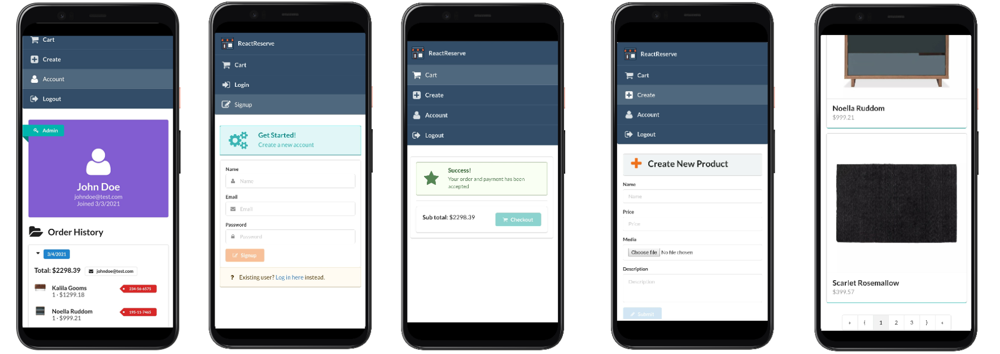

<h1 align="center">
  
  <br>
Serves Fast
</h1>

# Full Stack React Next.js MongoDB Express.js E-Commerce Application
> Best practices to learn  Next.js. Fundamentals concepts of e-commerce applications are covered.

## Table of contents

- [Initial Configuration](#initial-configuration)
- [Developing](#developing)
- [Deploying/Publishing](#deploying-/-publishing)
- [Features](#features)
- [Covered Topics](#covered-topics)
- [Links](#links)

  

### Initial Configuration

1. Database
   
We are using [MongoDb Atlas](https://www.mongodb.com/cloud/atlas/lp/try2?utm_source=google&utm_campaign=gs_emea_netherlands_search_core_brand_atlas_desktop&utm_term=mongodb%20atlas&utm_medium=cpc_paid_search&utm_ad=e&utm_ad_campaign_id=12212624536&gclid=Cj0KCQiAhP2BBhDdARIsAJEzXlENhhMw2W76Dl-ZoL-toHgfrm7LIQfTOLETUeR6eBdO1KMLwp3d0pQaAuXwEALw_wcB) but you can also choose local database integration. You need `MongoDb Connection String`  to connect your cluster.

2. Image Upload

You need `Cloudinary Url`

3. Payment

You need `Stripe Key`

4. Deployment

[Vercel](https://vercel.com/) account


- Make sure you have installed `Node.js` and `npm`.
- NOTE: In the rest of the documentation, you will come across npm being used for running commands. To use yarn in place of npm for the commands, simply substitute npm for yarn. Example, npm start as yarn start. For more help, checkout [migrating from npm](https://classic.yarnpkg.com/en/docs/migrating-from-npm/).

### Developing


```shell
git clone https://github.com/mejustdev/nextcom
cd nextcom
npm install
```
In order to seed database use `static` / `products.json` and follow this [video](https://www.youtube.com/watch?v=tpz-6Trd1UI)'s intructions and import it to the MongoDb Atlas.
#### Building

Create `next.config.js` file at the root of your application. Paste your credentials. Do not forget to add this file to the `.gitignore`.

```shell
module.exports = {
  env: {
    MONGO_SRV:'',
    JWT_SECRET: '',
    CLOUDINARY_URL: '',
    STRIPE_SECRET_KEY: '',
  },
};
```
#### Running on Development Mode


```bash
cd nextcom
npm run dev

# Server should be listening on localhost:3000
```

### Deploying / Publishing

Create your repository on Github. Then use Git Flow and finally push it to the remote.

```shell
git add .
git commit -m "initializing project"
git push origin main
```

Now You should see your repository to be updated. 

You can deploy your project via ***Vercel CLI*** or ***Vercel dashboard***

Visit for more detailed information about deployment on [Vercel](https://vercel.com/docs/platform/deployments)

> **Don't forget to make sure your production database is not whitelisted in MongoDB Atlas, otherwise the database connection will fail and your app will crash.**

`CLI`

```shell
npm i -g vercel
vercel
```
After deploying, go to the  `utils` / `baseUrl.js` and update **production url** with yours and again use Git Flow and your app will be automatically re-deployed.
### Features

- Complete User **Authentication** (Login / Signup)
- **Authorization** and Managing Multiple User Roles (guest, user, admin)
- Image and File Uploads
- **Server-side Rendering**
- Pagination
- Payment Processing
- Responsive + Mobile-First Design
- App Deployment with **Vercel** 



### Covered topics

- **React Hooks** throughout the entire App
- Next.js API Routes
- User authentication with **JWT and Cookies**
- **Role-based access control** with multiple user types
- **Password hashing** with bcrypt
- Process payments with **Stripe API**
- Dynamically upload images with **Cloudinary API**
- Modeling database content with **Mongoose Schemas**
- Creating Impressive UIs with **Semantic UI React**
- Managing MongoDB database with the **Atlas** Interface
- App Deployment with Serverless Deployment Service **Vercel**
- **Protecting private client routes** with Next.js / React
- **Securing private data** with environment variables
- **Validating Requests** in Node / Express Apps

### Contributing

"If you'd like to contribute, please fork the repository and use a feature
branch. Pull requests are warmly welcome."

### Links

- Project homepage: https://nextcom-eight.vercel.app/
- Repository: https://github.com/mejustdev/nextcom
- Issue tracker: https://github.com/mejustdev/nextcom/issues
  - In case of sensitive bugs like security vulnerabilities, please contact
    mejustdev@gmail.com directly instead of using issue tracker. I value your effort
    to improve the security and privacy of this project!
- Related projects:
  - Same project deployed to Heroku: https://react-next-e-commerce.herokuapp.com/
  


### Licensing

"The code in this project is licensed under MIT license."

